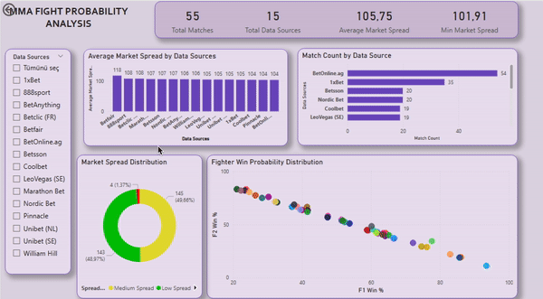

# 🥊 MMA Match Probability & Market Analysis

> A live data analytics project examining probability pricing across multiple sports betting markets, built with Python, PostgreSQL, and Power BI.

---

## Project Overview

This project analyzes how 15 different market operators price upcoming MMA matches and uncovers which ones offer the most efficient (lowest spread) markets. The pipeline pulls live data from The Odds API, processes it through PostgreSQL and pandas, and visualizes the insights in an interactive Power BI dashboard.

**Key questions:**
- Which operators offer the most competitive pricing?
- How much does pricing disagree across markets for the same match?
- What does the implied probability distribution look like across all matches?
- Where does market overround (structural margin) come from?

---

## Dashboard Demo

---

## 📊 Dashboard Preview

The dashboard includes:
- *KPI cards:* total matches, total data sources, average market spread, minimum market spread
- *Bar charts:* average market spread by operator, match coverage by operator
- *Donut chart:* distribution of matches across spread categories (Low / Medium / High)
- *Scatter plot:* Fighter 1 vs Fighter 2 implied win probability for every active match
- *Interactive slicer:* filter all visuals by data source

All visuals support cross-filtering —clicking any element updates the rest of the dashboard.

---

##Key Insights

- **Pinnacle** consistently shows the lowest market spread (~103.7%), making it the most efficient market for bettors
- **BetOnline.ag** has the broadest match coverage and competitive pricing
- **Betfair** operates as an exchange rather than a fixed-odds operator, which inflates raw margin calculations and required filtering during analysis
- The implied probability scatter shows a clean inverse relationship — markets are internally consistent
- Around half of all match-operator observations fall into the "Low Spread" category, suggesting consistent pricing across most operators

---

## 🛠️ Tech Stack

| Layer | Tool |
|---|---|
| Data Source | The Odds API |
| Pipeline | Python (requests, pandas, SQLAlchemy, psycopg2) |
| Database | PostgreSQL (managed via pgAdmin) |
| Analysis | SQL + pandas |
| Visualization | Power BI Desktop |
| IDE | PyCharm |

---

## 📁 Repository Structure

mma-match-probability-analysis/
├── fetch_odds.py              |Pulls live odds data from The Odds API into PostgreSQL
├── analysis.py                |Reads data, calculates implied probabilities and margins, exports CSV
├── analysis_queries.sql       |Full SQL analysis (8 sections, fully documented)
├── mma_fight_analysis.csv     |Latest exported snapshot used by the dashboard
├── MMA_Probability_Analysis.pbix  |Power BI dashboard file
├── mma_dashboard1.gif          |Dashboard interaction demo
├── screenshots/                |Static dashboard views
├── requirements.txt            |Python dependencies
├── .env.example                |Template for environment variables
└── .gitignore                  |Files excluded from version control
